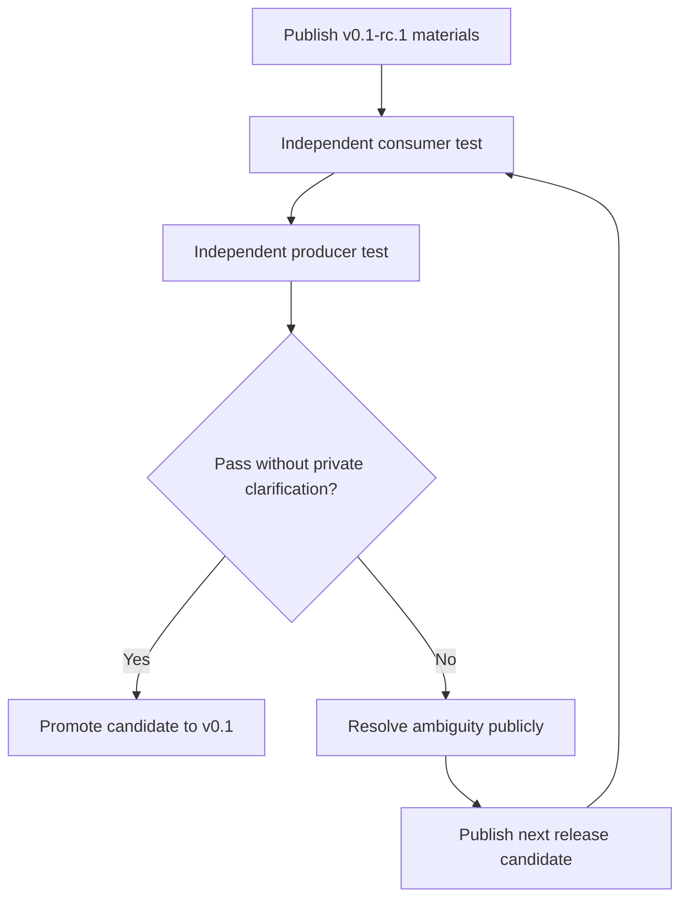
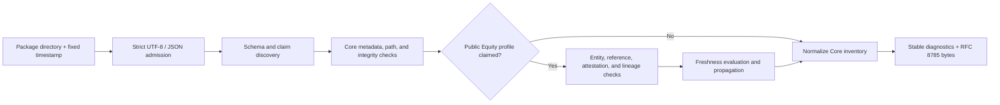
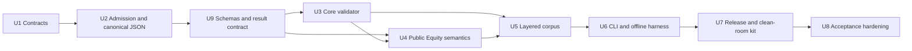

# OFF v0.1 Layered Conformance Corpus - Plan

## Goal Capsule

- **Objective:** Implement an experimental OFF v0.1 release line that proves clean-room consumption and production through a layered conformance corpus.
- **Product authority:** `STRATEGY.md` governs product identity; this Product Contract governs v0.1 scope and supersedes conflicting provisional scope in earlier planning drafts.
- **Execution boundary:** Build and verify v0.1-rc.1 locally. Do not promote it to v0.1 or claim independent interoperability until an unaffiliated implementer completes both clean-room tasks.
- **Open blockers:** None block v0.1-rc.1 implementation. Recruiting an unaffiliated implementer remains the external promotion gate for v0.1.
- **Tail ownership:** The implementing agent owns the specification, schemas, reference implementation, corpus, release-candidate kit, tests, and local Git delivery; it must leave the external clean-room evidence template unclaimed.

---

## Product Contract

### Summary

OFF will publish a release-candidate series centered on a layered conformance corpus with one profile-agnostic Core package and one Traceable Public Equity Research package.
The corpus will define deterministic normalized results and support offline clean-room tests of both consumption and production before any candidate is promoted to v0.1.

### Problem Frame

OFF needs to prove that its public specification is implementable without conventions known only to its authors.
Existing analysts demonstrate the publishing problem through spreadsheets, PDFs, screenshots, and newsletter attachments, but no independent prospective user has yet attempted to adopt OFF.

The immediate claim is therefore interoperability, not adoption.
A credible v0.1 must show that independent implementations interpret the same package consistently and that an unaffiliated producer can create a conforming package from public materials alone.

### Key Decisions

- **The manifest is normative.** (session-settled: user-directed — chosen over a normative generation process: conformance must start at the portable result without adding an authoring language, build process, or synchronization problem.) `off.json` is the source of truth; authoring tools may produce it but do not define conformance.
- **Use a layered conformance corpus.** (session-settled: user-directed — chosen over one all-up package and an exhaustive fixture matrix: separate fixtures expose profile boundaries without overbuilding the first release candidate.) The corpus begins with a minimal Core package, a Traceable Public Equity Research package, and a small boundary-focused fixture set.
- **Define only two normative profiles.** (session-settled: user-directed — chosen over standardizing presentation and authoring conventions in v0.1: the release should test research semantics without freezing implementation choices.) OFF Core 0.1 and OFF Public Equity Research 0.1 are normative; narrative, authoring, binding, viewer, and presentation conventions are illustrative.
- **Use Traceable, not unqualified Auditable.** (session-settled: user-directed — chosen over an Auditable label: structural validation cannot independently prove that author-declared lineage is complete.) Lineage completeness remains an attestation bound to the package artifact.
- **Keep structural conformance offline.** (session-settled: user-directed — chosen over network-dependent validation: fixed local inputs are required for deterministic and independently reproducible results.) Remote descriptors may be reported, but network results cannot change structural conformance.
- **Promote a tested release candidate.** (session-settled: user-approved — chosen over naming the initial public draft v0.1: the v0.1 label should carry clean-room evidence.) Public materials begin at v0.1-rc.1, and the first candidate that passes the unaffiliated consumer and producer test becomes v0.1.
- **Separate interoperability from adoption.** (session-settled: user-approved — chosen over gating v0.1 on a real model and multiple renderers: implementability and market demand are distinct claims.) Real-model publishing becomes the first post-v0.1 adoption milestone.
- **Diagnostics protect semantic determinism.** A package is invalid when a violation makes its claimed profile false or permits materially different semantic interpretations; warnings may flag usefulness or quality concerns but cannot waive information required for interpretation.
- **Keep XBRL illustrative at the evidence boundary.** A non-normative mapping example may show how a generic OFF evidence resource and author-declared locator correspond to XBRL, but no XBRL shape or behavior enters the rc.1 conformance claim.

### Actors

- A1. **OFF maintainer:** Publishes normative materials, expected outcomes, release candidates, and public clarifications.
- A2. **Independent implementer:** Builds a consumer and producer without private guidance from OFF's authors.
- A3. **Package author:** Creates a new package from the public specification and examples; this role may be performed by A2 during the clean-room test.
- A4. **Conforming consumer:** Parses, normalizes, validates, and evaluates packages against a fixed context; the reference validator and independent implementation both perform this role.

### Requirements

**Release contract**

- R1. v0.1-rc.1 must publish a normative specification, JSON Schema, reference validator, offline conformance harness, positive reference packages, and boundary-focused diagnostic fixtures.
- R2. `off.json` must be the normative structured source of truth, while `OFF.md`, templates, generators, and agent workflows remain non-normative inputs or resources.
- R3. A release candidate may be promoted to v0.1 only after an unaffiliated implementation completes both the consumer and producer clean-room tasks using public materials alone.
- R4. Any ambiguity that requires private clarification must be resolved publicly in a new release candidate before the clean-room test restarts.
- R5. Promotion to v0.1 may claim clean-room implementability and interoperability, but it must not claim adoption or independently verified financial correctness.

**Normative profiles**

- R6. OFF Core 0.1 must let a generic consumer identify the package and release, validate declared authorship and licensing metadata, inventory resources, resolve local resources, verify declared integrity, locate the human entrypoint and canonical release, and discover declared profiles or extensions; it does not prove identity, ownership, or legal rights.
- R7. The Core reference package must contain only `off.json` and one local resource, with no security identity, assumptions, outputs, sources, or lineage.
- R8. OFF Public Equity Research 0.1 must define security identity, scenarios, stable assumptions and headline outputs, sources, freshness evaluation, and author-declared headline lineage.
- R9. The highest v0.1 Public Equity Research claim must be Traceable and must expose structural conformance separately from attested lineage completeness.
- R10. Unknown namespaced extensions must survive normalization canonically without requiring a Core consumer to interpret them.

**Normalization and semantics**

- R11. Every conformance run must declare the OFF version, normalizer contract version, and fixed evaluation timestamp used to derive its result.
- R12. Evaluation context, outcome, and diagnostics are always present in the normalized representation. Package identity, resource inventory, profile entities, resolved lineage, derived freshness, and preserved namespaced extensions appear only after their prerequisite stages succeed, according to the normative retention matrix.
- R13. Canonicalization rules must make dates, numbers, URLs, missing values, references, paths, and ordering produce byte-comparable canonical JSON across correct implementations.
- R14. The normalized representation must exclude absolute local paths, UI state, display formatting, and implementation-specific objects.
- R15. A Traceable headline output must expose its stable identity, typed value, as-of date, artifact binding, methodology note, and declared material dependency path.
- R16. Traceable lineage must terminate in sourced facts or explicit analyst assumptions, and its completeness attestation must carry author, timestamp, artifact hash, lineage basis, materiality scope, and known exclusions.
- R17. The validator must verify structural lineage coherence, resolvable references, terminal evidence designations, and deterministic freshness propagation while reporting lineage completeness as attested and not independently verified.
- R18. The Public Equity Research reference package must be evaluated at multiple fixed timestamps so the same immutable release yields expected current and stale states.

**Resources and diagnostics**

- R19. Structural conformance evaluation must make no network requests, and any remote descriptor must report availability and integrity as not evaluated.
- R20. Content required to determine package meaning or a claimed profile must be available locally even when the package also declares a remote location.
- R21. Invalid outcomes must identify violations that prevent deterministic identification, resolution, integrity checking, normalization, or truthful profile claims.
- R22. Warning outcomes may identify freshness, completeness, host safety, usefulness, or presentation concerns only when package meaning and the claimed profile remain deterministic and true.
- R23. Diagnostics must expose stable codes, severity, the affected entity or structured location, and deterministic parameters sufficient for equivalent independent output.

**Layered conformance corpus**

- R24. The positive corpus must contain one deliberately profile-agnostic Core package and one synthetic Public Equity Research package with a Traceable claim.
- R25. v0.1-rc.1 must include only a small set of boundary-focused valid-with-warning and invalid fixtures, each with hand-reviewed expected normalized output and diagnostic codes where applicable.
- R26. The consumer clean-room task must require an independent implementation in another language to normalize every valid package, reproduce expected diagnostics, evaluate freshness at fixed timestamps, and resolve headline lineage.
- R27. The producer clean-room task must require the independent implementer to author a new Public Equity Research package that the reference validator accepts without private clarification.
- R28. The complete conformance suite must run offline from a fresh checkout using only versioned public materials.

### Key Flows

- F1. **Publish a release candidate**
  - **Trigger:** A1 judges the normative materials and expected results ready for public testing.
  - **Actors:** A1, A4
  - **Steps:** Publish the specification, schema, reference validator, layered corpus, expected results, and offline harness; run the full corpus from a fresh checkout.
  - **Outcome:** A versioned candidate is available for clean-room implementation.
  - **Covers:** R1, R2, R11-R25, R28
- F2. **Run the consumer clean-room test**
  - **Trigger:** A2 begins from the public release candidate without private guidance.
  - **Actors:** A2, A4
  - **Steps:** Implement parsing and normalization in another language; consume both positive packages; run every boundary diagnostic fixture; compare canonical output, diagnostics, freshness states, and lineage results.
  - **Outcome:** The candidate has evidence of equivalent independent interpretation or a public defect to resolve.
  - **Covers:** R3-R5, R26, R28
- F3. **Run the producer clean-room test**
  - **Trigger:** A2 completes enough consumer behavior to author a new package from public materials.
  - **Actors:** A2, A3, A4
  - **Steps:** Author a new Traceable Public Equity Research package and submit it to the reference validator without author assistance.
  - **Outcome:** The candidate has evidence of independent production or a public defect to resolve.
  - **Covers:** R3-R5, R27-R28
- F4. **Resolve a clean-room ambiguity**
  - **Trigger:** A2 cannot proceed without clarification or produces a materially divergent result.
  - **Actors:** A1, A2
  - **Steps:** Stop the current test; document the ambiguity publicly; revise normative or conformance materials; publish a new release candidate; restart from public materials.
  - **Outcome:** No private convention becomes part of the v0.1 interoperability claim.
  - **Covers:** R4-R5

### Acceptance Examples

- AE1. **Covers R6-R7, R24.** Given the Core reference package, when a generic consumer validates and normalizes it, then the result contains only generic package and resource semantics and passes Core without requiring finance-specific knowledge.
- AE2. **Covers R8-R18, R24.** Given the synthetic Public Equity Research package, when it is evaluated at each fixed timestamp, then its canonical outputs match the expected current and stale states while the package bytes remain unchanged.
- AE3. **Covers R9, R15-R17.** Given structurally coherent author-declared lineage, when validation succeeds, then the result reports Traceable structural conformance and identifies lineage completeness as attested rather than independently verified.
- AE4. **Covers R19-R20.** Given a package that declares a remote supporting resource but includes all meaning-bearing content locally, when conformance runs offline, then structural conformance is unaffected and remote availability and integrity are not evaluated.
- AE5. **Covers R21-R23, R25.** Given a missing requirement that permits materially different normalized meaning, when the fixture is evaluated, then it is invalid rather than valid with warnings and emits the expected stable diagnostic.
- AE6. **Covers R22-R23, R25.** Given deterministic package meaning with a stale or presentation-quality concern, when the fixture is evaluated, then it remains valid with warnings and no warning substitutes for required semantic information.
- AE7. **Covers R3-R4, R26-R28.** Given an independent implementer who needs private clarification, when OFF supplies that clarification, then the current clean-room attempt does not qualify and a publicly revised release candidate must be retested.
- AE8. **Covers R3, R27-R28.** Given only public v0.1 candidate materials, when the independent implementer authors a new Traceable package, then the reference validator accepts it without example-specific exceptions.

### Success Criteria

- A first-time author can create the minimal Core package in ten minutes or less using only public materials.
- Every headline output in the Public Equity Research reference package has complete declared structural lineage and a bound completeness attestation.
- The same immutable Public Equity Research package produces deterministic current and stale results at its fixed evaluation timestamps.
- The reference consumer and at least one unaffiliated implementation emit byte-equivalent normalized representations and equivalent diagnostics for the corpus.
- The complete conformance suite passes offline from a fresh checkout.
- The unaffiliated implementer authors a new Traceable package accepted by the reference validator without private clarification.
- Valid, valid-with-warning, and invalid outcomes remain visibly and semantically distinct.

### Scope Boundaries

**Deferred for later**

- A real-company model, external analyst design partnership, multi-renderer publishing, and adoption evidence belong to the first post-v0.1 milestone.
- `OFF.md` conventions, XLSX semantic bindings, reader and presentation metadata, Market Terminal design, viewers, renderers, templates, and manifest generators remain illustrative or optional.
- Exhaustive rule-by-rule fixtures, other asset-class profiles, tool-extracted or independently reviewed lineage, execution graphs, and interactive recalculation are future extensions.
- A registry, discovery, social feed, comments, reputation, and collaboration may sit above the format only after a useful supply of maintained models exists.
- XBRL taxonomy resolution, XBRL/OIM parsing, Inline XBRL extraction, fact-value verification, calculation-link processing, Formula execution, and cross-syntax equivalence belong to a future optional XBRL Evidence profile.

**Outside this product's identity**

- OFF does not replace spreadsheets or define a universal calculation runtime.
- OFF does not provide brokerage connectivity, trade execution, or automated investment recommendations.
- OFF conformance must not depend on a proprietary platform, hosted API, viewer, or SDK.

### Illustrative XBRL Compatibility Note

The rc.1 repository includes a non-normative mapping appendix, not a versioned XBRL extension or conformance fixture. It shows a generic normative OFF source-to-evidence relationship whose local resource is integrity-checked like any other resource, plus an author-declared XBRL locator assertion whose status is always `notEvaluated`.

The appendix may show both plausible and deliberately nonexistent locators producing the same OFF result. This makes the non-claim concrete: OFF does not parse the report, resolve the taxonomy, verify the fact, or treat a locator as provenance proof. Every conformance-critical value, date, unit, freshness field, and lineage edge remains explicit in `off.json`.

### Dependencies / Assumptions

- No independent prospective user has yet supplied direct demand evidence; current evidence is proxy publishing behavior.
- Promotion to v0.1 depends on recruiting an unaffiliated implementer, while post-v0.1 adoption validation depends on a separate external analyst design partner.
- Hand-reviewed expected normalized outputs and diagnostic codes are the v0.1 oracle and require disciplined review whenever normative behavior changes.
- JSON Schema will cover structural constraints, while deterministic semantic checks will also require normative prose and validator behavior.

### Sources / Research

- `STRATEGY.md` — product problem, approach, primary user, metrics, tracks, and exclusions.
- `docs/SPEC_V0_1_DRAFT.md` — provisional package semantics, IDs, lineage, freshness, conformance, and validator boundaries.
- `docs/DECISIONS.md` — locked product posture and deferred capabilities.
- `docs/OPEN_QUESTIONS.md` — unresolved package, authoring, freshness, and lineage questions that this contract narrows.
- `docs/ROADMAP.md` — earlier v0.1 examples and later validator/conformance phases superseded where they conflict with this contract.
- `docs/RESEARCH.md` — precedents from research-object, package, provenance, artifact, and licensing standards.
- [RFC 8785](https://www.rfc-editor.org/rfc/rfc8785.html) — canonical JSON and I-JSON admission constraints.
- [JSON Schema Draft 2020-12](https://json-schema.org/draft/2020-12) — normative schema dialect.
- [XBRL Open Information Model 1.0](https://www.xbrl.org/Specification/oim/REC-2021-10-13%2Berrata-2023-04-19/oim-REC-2021-10-13%2Bcorrected-errata-2023-04-19.html) and [xBRL-JSON 1.0](https://www.xbrl.org/Specification/xbrl-json/REC-2021-10-13%2Berrata-2023-04-19/xbrl-json-REC-2021-10-13%2Bcorrected-errata-2023-04-19.html) — syntax-independent fact aspects and the illustrative JSON evidence bridge.

### Product Contract Preservation Note

- Preserved: R1-R5 and R7-R28, A1-A4, F1-F4, and AE1-AE8 retain their product meaning and identifiers.
- Clarified: R6 now says the validator validates authorship and license declarations; it does not certify identity, ownership, or legal truth.
- Added from the latest user direction: the illustrative XBRL compatibility note maps OFF evidence to XBRL without adding a normative requirement, profile, or corpus gate.
- Superseded: the earlier planning-only authorization note is removed because invoking LFG explicitly authorizes implementation.

---

## Planning Contract

### Key Technical Decisions

- KTD1. `off.json` is the only normative package manifest. (session-settled: user-directed — chosen over generated-manifest conformance: the portable result must stand alone without an authoring language or synchronization step.) A Public Equity Research claim includes Core requirements and is represented by a profile URI in the same manifest.
- KTD2. The rc.1 schema dialect is JSON Schema Draft 2020-12, with stable absolute `$id` values and a bundled schema graph. Structural schemas and OFF semantic rules are separate stages because schemas cannot verify resource bytes, graph coherence, fixed-time freshness, or lineage attestations. A versioned rule registry assigns each rule to one authoritative stage, its prerequisites, and diagnostic emission contract. The boundary-focused corpus is declared separately by `conformance/corpus.json`; the registry does not imply an unpublished rule-by-rule fixture matrix. Disagreement among prose, schema, registry, or reference behavior is a release-candidate defect resolved under R4.
- KTD3. Input admission is strict UTF-8 and I-JSON, followed by RFC 8785 JSON Canonicalization Scheme output. Duplicate object names, lone surrogates, non-finite values, and numeric literals that cannot round-trip as IEEE-754 binary64 are invalid; strings are never Unicode-normalized. Known OFF numeric fields accept only canonical nonnegative safe-integer lexemes from `0` through `9007199254740991`; numbers inside opaque extensions follow finite binary64/JCS admission and may use other valid JSON number spellings before canonicalization.
- KTD4. Exact signed, fractional, or larger domain values use canonical decimal strings, not JSON numbers. The lexical form has no exponent, leading plus, redundant leading zero, trailing fractional zero, or negative zero; units and currencies are separate stable entities.
- KTD5. Dates are valid ISO 8601 calendar dates and conformance timestamps are RFC 3339 UTC at whole-second precision with `Z`. Missing optional data is represented only by omission; `null` is invalid unless a future field explicitly permits it.
- KTD6. URI identity is the exact admitted string. Profile, schema, extension, and other identifier URIs are inert absolute RFC 3986 strings; canonical release and remote resource locations require HTTPS and forbid userinfo. Scheme or host case changes, default ports, escape spelling, and Unicode alternatives are distinct OFF identifiers rather than normalized equivalents. The evaluator never passes any URI to a loader.
- KTD7. Local resources use a restricted ASCII, POSIX-style package-relative path grammar. Absolute paths, empty or dot segments, `..`, backslashes, percent signs, query or fragment markers, control characters, symlinks, non-regular files, and case-colliding paths are invalid; rc.1 validates unpacked directories only.
- KTD8. Every local meaning-bearing resource has a declared byte size and lowercase SHA-256 digest over raw bytes. `off.json` is the descriptor and is not self-hashed; Traceable attestations bind to a declared model or research artifact resource and its digest.
- KTD9. Freshness uses explicit `staleAt` for sourced facts and `reviewBy` for analyst assumptions. A leaf is current before its threshold and stale at or after it; headline status is the worst material dependency status in deterministic graph order.
- KTD10. Lineage edges point from dependent to dependency. The validator builds bounded adjacency lists, rejects self-edges and invalid endpoints, detects cycles with an iterative Kahn topological sort using stable-ID tie ordering, and propagates freshness in reverse topological order without recursive graph traversal.
- KTD11. Diagnostics are OFF-owned semantic records, not raw validator messages. The stable contract is `code`, `severity`, `instanceLocation`, optional `entityId` and `ruleId`, and canonical parameters; deterministic ordering is severity rank, code, location, entity, rule, then canonical parameters.
- KTD12. Validation is a stage-gated pipeline over one normative evaluation primitive. Admission failures stop schema work; Core failures stop profile semantics; graph failures stop freshness propagation. Every `packageResult` path, including a manifest parse failure, emits a normalized envelope retaining evaluator-supplied version/timestamp context, outcome, and diagnostics without cascades; `evaluatorFailure` bypasses normalized-envelope and canonical-output production.
- KTD13. The reference implementation is an ESM TypeScript package targeting Node.js 22.13 or newer within the Node 22 line, with exact Node, pnpm, TypeScript, Ajv, and esbuild versions pinned in the release tree. Ajv runs through `Ajv2020` with strict/all-errors enabled, coercion/default insertion/property removal disabled, no async loader, and the bundled graph preloaded by `$id`; OFF semantic validators own URI/date/time rules and all public diagnostics. esbuild produces a source-map-free single-file ESM distribution containing runtime dependencies, so corpus verification needs only Node and a fresh checkout.
- KTD14. XBRL is a non-normative mapping example, not a processor or rc.1 extension contract. The OFF source's generic `evidenceResourceId` can point to any hashed local artifact. An author-declared XBRL locator assertion is illustrative opaque metadata with `notEvaluated` status and no stability or correctness claim.
- KTD15. Public artifacts are versioned as v0.1-rc.1, including specs, schemas, corpus, distribution, checksums, changelog, and clean-room instructions. A normative ambiguity creates a new immutable candidate; rc.1 is never patched in place after publication.
- KTD16. Profile declaration and profile evaluation are distinct. Core normalization inventories every declared profile; each requested profile result is `passed`, `failed`, or `notEvaluated`. An unknown profile does not invalidate Core unless the caller explicitly selects it as a required target that the evaluator cannot satisfy.
- KTD17. Package conformance and evaluator failure are distinct. The public API returns either `packageResult`, containing normalized-schema-valid canonical bytes for valid, warning, or invalid packages, or `evaluatorFailure`, containing a stable tool code and sanitized operation context with no package verdict or canonical bytes. Reference safety limits, permissions, short reads, concurrent mutation, and runtime faults are evaluator failures rather than format rules.
- KTD18. rc.1 accepts an owned, quiescent package directory; concurrent attacker-writable trees are outside the conformance evaluator's threat model and must be snapshotted by the embedding host before evaluation. The resolver still inspects path components without following links, confirms exact entry spelling, opens only contained regular files, and computes size and digest from one descriptor.
- KTD19. Resource contents are opaque raw bytes in rc.1. The validator never sniffs media types, parses or renders declared resources, expands entities, lists or decompresses archives, or interprets illustrative locators.

### High-Level Technical Design

The design is a deterministic pipeline with explicit gates. Modules may be refactored while implementing, but the observable stages and their stop conditions are normative.

The primary public API accepts an owned quiescent package root, explicit evaluation timestamp, and requested profile targets. It returns a discriminated union: `packageResult` carries an in-memory normalized result and canonical bytes, while `evaluatorFailure` carries only a stable tool code and sanitized operation context. A readable root without `off.json` is package-invalid; root permissions, mid-read mutation, or internal faults are evaluator failures. `validate`, `normalize`, and corpus behavior are projections of this one primitive rather than separate validators.

The normalized result envelope has its own normative schema and contains evaluation context, package outcome, requested and declared profile results, package identity when available, sorted resource inventory, sorted Public Equity entities, sorted dependent-to-dependency lineage edges, derived freshness, preserved namespaced extensions, and sorted diagnostics. It never contains the package's absolute filesystem path, stack traces, local clock values, UI state, or implementation-specific Ajv errors.

### Conformance Stage Contract

| Stage | Input precondition | Invalidates on | Output retained |
|---|---|---|---|
| Admission | Root `off.json` bytes | Invalid UTF-8/JSON, duplicate names, disallowed Unicode/numbers | Evaluation context, invalid outcome, and admission diagnostics; all package-derived members omitted |
| Schema | Admitted object | Required shape, lexical, version, or profile-claim violations | Evaluation context, outcome, declared-profile inventory when readable, and schema diagnostics; package entities omitted |
| Requested profile target | Admitted object whose true root shape is readable | Missing or unsupported caller-required profile URI | Request diagnostic and failed requested-profile row; this non-gating stage contributes to the overall outcome without changing independently derived Core status or retention |
| Core | Core schema passed | Unsafe/missing resources, size/hash mismatch, false Core claim | Schema-admitted identity and resources retained; unsafe/unverified resources excluded; requested profile results and diagnostics retained |
| Public Equity | Core passed and profile requested | Duplicate/unresolved entities, invalid attestation or lineage graph | Schema-admitted profile entities retained only after the entire profile schema passes; resolved lineage and derived freshness omitted when graph validation fails |
| Freshness | Profile graph passed | No structural invalidation; stale leaves and propagated headline states produce one leaf warning plus one warning per affected headline | Complete entities, lineage, derived leaf/output status, profile result, and diagnostics |
| Canonical output | Any prior stage | Internal inability to serialize is a reference-implementation failure | RFC 8785 bytes and deterministic exit class |

Independent violations within the active stage are all collected according to the rule registry, then final normalized diagnostics use KTD11's severity/code/location/entity/rule/parameters ordering tuple. A failed prerequisite suppresses every dependent rule, and schema-library multiplicity is collapsed through an OFF-owned rule-to-code table with exact JSON Pointer locations. Human messages never participate in equivalence.

### Assumptions

These are planning-time bets made in the headless LFG run and are not session-settled product decisions.

- The XBRL request is satisfied by a non-normative author-declared locator appendix; the corpus exercises generic namespaced-extension preservation, and normative XBRL semantic verification remains deferred.
- An unpacked directory is sufficient for the clean-room package contract. ZIP or tar transport can be specified later without weakening portable resource semantics.
- Node 22.13 is an acceptable minimum tool for the reference harness, while the format remains language-neutral and the independent consumer must use another language.
- A checked-in ESM bundle is acceptable public release material even though contributors use pnpm and a lockfile to rebuild it.
- All project materials may use Apache-2.0 for rc.1 unless a later governance decision establishes separate specification and code licenses.
- Release-candidate implementation and local validation may complete without a hosted registry, Git remote, or public website; promotion and independent evidence remain explicitly unfulfilled.
- The reference evaluator documents conservative safety limits for manifest bytes, JSON depth and width, string and extension bytes, resource counts and bytes, path length and depth, entity and edge counts, and diagnostics. These are tool limits, not OFF format validity rules; exceeding one returns `evaluatorFailure`, and an independent implementation may support more while still passing the bounded corpus.

### System-Wide Impact

- **Specification/schema parity:** `spec/rules-0.1.json` assigns every normative rule to the schema or semantic authority and maps prerequisites and diagnostic emission. `conformance/corpus.json` independently names the smaller published boundary corpus. Prose, schemas, reference behavior, and tests mirror those contracts without silently extending them; any mismatch forces a new release candidate.
- **Versioning:** OFF version, normalizer contract version, profile URIs, input and normalized-result schema `$id` values, fixture expectations, diagnostics, and distribution checksums advance together for a normative change.
- **Security:** Validation treats bytes and declared paths as untrusted but requires an owned quiescent root. It performs no DNS, socket, fetch, datagram, child-process, or other network-capable action; opens only contained regular files; streams hashing in bounded chunks; suppresses host paths and terminal controls from output; and never parses or renders declared resources in rc.1.
- **Data integrity:** Digests cover raw bytes, normalization never mutates source artifacts, and expected outputs are reviewed canonical bytes rather than implementation snapshots.
- **Cross-language parity:** Domain sorting, lexical forms, graph direction, threshold boundaries, stage gating, and diagnostic parameters are specified independently of TypeScript or Ajv behavior.

### Risks and Mitigations

- **Schema and semantic drift:** Make the rule registry authoritative for stage ownership and diagnostics, fail release validation on an unregistered constraint or code, and route any cross-layer disagreement through the public R4 ambiguity process.
- **False audit confidence:** Render the highest result as `Traceable — author-declared lineage`, with structural conformance and completeness attestation as separate fields.
- **Filesystem escape:** Resolve package and target real paths, reject symlinks before reading, enforce containment and regular-file status, and cover traversal variants with fixtures and tests.
- **Filesystem race:** State the owned-quiescent-root precondition in the API and CLI. Production hosts must snapshot attacker-writable trees before invoking OFF; any mutation detected during evaluation becomes evaluator failure rather than a package verdict.
- **Floating-point surprise:** Restrict exact financial quantities to decimal strings and fixture binary64 boundaries, negative zero, and exponent forms.
- **Diagnostic cascade or library coupling:** Gate stages and translate Ajv output to OFF codes; golden files omit human message text and library ordering.
- **Offline bundle drift:** Define a closed release tree containing the ESM bundle, schemas, corpus, specs, and clean-room kit; prohibit dynamic imports or schema downloads; rebuild under pinned Node/pnpm versions and verify the tree checksums. The checksum manifest and signature metadata are excluded from their own digest set.
- **XBRL overclaim:** Call the appendix metadata an author-declared locator assertion with `notEvaluated` status, not a verified binding, and state that OFF does not validate XBRL, resolve taxonomies, or equate calculation linkbases with complete model lineage.
- **Premature v0.1 claim:** Keep clean-room evidence fields explicitly pending and make release validation reject a v0.1 label without the public independent implementation report.

### Sequencing

---

## Implementation Units

### U1. Freeze the normative contracts and repository scaffold

- **Goal:** Establish one internally consistent v0.1-rc.1 contract before validator behavior accretes.
- **Requirements:** R1-R10, R19-R23; F1
- **Files:** `README.md`, `LICENSE`, `.node-version`, `package.json`, `pnpm-lock.yaml`, `tsconfig.json`, `spec/OFF-Core-0.1.md`, `spec/profiles/public-equity-research-0.1.md`, `spec/normalization-0.1.md`, `spec/diagnostics-0.1.md`, `spec/conformance-0.1.md`, `spec/rules-0.1.json`, `spec/examples/xbrl-source-locator.md`, `docs/START_HERE.md`, `docs/SPEC_V0_1_DRAFT.md`, `docs/DECISIONS.md`
- **Approach:** Use RFC 8174 normative keywords and make `off.json`, profile inheritance, stage gating, the known-field versus opaque-extension number-token table, lexical forms, path safety, no-network behavior, Traceable qualification, and XBRL non-claims explicit. Mark conflicting legacy generated-manifest, `MODEL.md`, Presentation-profile, and Auditable language as superseded rather than leaving two authorities.
- **Test scenarios:** A reader can locate every normative artifact from `README.md`; every rule-registry entry names one authoritative stage and diagnostic; a search finds no current instruction that makes manifest generation, Presentation, XBRL locators, or unqualified Auditable conformance normative.
- **Verification:** Documentation contract checks pass, internal links resolve, and every R-ID maps to a normative section or an explicitly illustrative artifact.
- **Dependencies:** None.

### U2. Implement strict admission and canonical JSON

- **Goal:** Make raw manifest bytes produce one language-independent admitted value or one deterministic admission failure before schema behavior begins.
- **Requirements:** R2, R11-R14, R21-R23; AE5
- **Files:** `src/constants.ts`, `src/types.ts`, `src/json/parse.ts`, `src/json/jcs.ts`, `test/json.test.ts`, `test/vectors/rfc8785/`
- **Approach:** Apply fatal UTF-8 decoding, then a bounded single-pass token scan that tracks duplicate-key scopes, raw numeric lexemes, surrogate validity, structural counts, and JSON Pointer locations before ordinary parsing. Publish a number-token acceptance table and implement RFC 8785 serialization without Unicode normalization.
- **Test scenarios:** For known OFF fields, reject `-0`, `1.0`, `1e2`, and `9007199254740992` while accepting `0` and `9007199254740991`; for opaque extensions, admit finite binary64 JSON number spellings and canonicalize them through JCS. Separately run the complete official RFC 8785 serializer vectors, reject malformed UTF-8, nested duplicate names and lone surrogates, preserve composed/decomposed Unicode distinctly, and prove byte idempotence.
- **Verification:** Exact canonical bytes match official vectors and independent expected files, not merely the implementation's own snapshots.
- **Dependencies:** U1.

### U9. Implement schemas, diagnostics, and the normalized-result contract

- **Goal:** Define the manifest/result shapes and deterministic schema-to-OFF diagnostic boundary over admitted JSON values.
- **Requirements:** R6-R13, R21-R23; AE1, AE5
- **Files:** `schemas/off-core-0.1.schema.json`, `schemas/profiles/public-equity-research-0.1.schema.json`, `schemas/normalized-result-0.1.schema.json`, `schemas/diagnostic-0.1.schema.json`, `src/schema.ts`, `src/diagnostics.ts`, `src/normalize.ts`, `test/schema.test.ts`, `test/diagnostics.test.ts`
- **Approach:** Preload the complete Draft 2020-12 graph synchronously by stable `$id` into `Ajv2020` with strict/all-errors enabled, coercion/defaults/property removal disabled, and no loader. Enforce URI/date/time semantics outside Ajv, translate library output through the rule registry, implement the exact retention matrix, and represent every declared/requested profile as passed, failed, or `notEvaluated`.
- **Test scenarios:** Cover every envelope gate, diagnostic suppression and final ordering, exact URI identity, missing versus omitted values, supported/unknown profile targets, schema multiplicity collapse, and normalized-result schema validity for valid, warning, and invalid package results.
- **Verification:** Release checks fail on an unregistered constraint/diagnostic or a schema/prose/reference mismatch, and tests compare only OFF-owned diagnostic fields.
- **Dependencies:** U2.

### U3. Implement Core validation and safe resource resolution

- **Goal:** Let a generic consumer identify, inventory, resolve, and integrity-check a package without profile knowledge or network access.
- **Requirements:** R6-R7, R10-R14, R19-R25; AE1, AE4-AE6
- **Files:** `src/core.ts`, `src/resources.ts`, `src/normalize.ts`, `test/core.test.ts`, `test/resources.test.ts`
- **Approach:** Validate identity and declarations, profile discovery/evaluation separation, entrypoint and canonical URL, extension namespace shape, resource relationships, local size/digest integrity, remote `notEvaluated` status, path containment, regular-file status, symlink rejection, and case-collision detection. Stream bounded reads from one descriptor, normalize inventories by stable ID, omit all host-local paths, and return evaluator failure when reference safety limits or host faults prevent evaluation.
- **Test scenarios:** Accept the one-resource Core package; reject missing declared files, wrong sizes or hashes, duplicate IDs/paths, empty/dot/traversal segments, drive/UNC/absolute paths, backslashes, percent escapes, trailing dots/spaces, Windows device names, symlinks, non-regular files, wrong-case spellings, and ASCII case collisions. Cover zero-byte and raw-binary resources, declared-size allocation attacks, final/intermediate/dangling/loop links, and prefix escapes; verify reference-limit and host-I/O cases return evaluator failure without a package verdict. Keep remote-only descriptors non-semantic and untouched by network code.
- **Verification:** Core tests run in temporary roots containing a secret canary and prove no absolute path, OS error, symlink target, stack trace, terminal escape, or canary enters machine or human output; DNS/socket/process tripwires remain unused.
- **Dependencies:** U9.

### U4. Implement Traceable Public Equity semantics

- **Goal:** Normalize source-backed public-equity entities, validate author-declared lineage, and derive fixed-time freshness without executing the model.
- **Requirements:** R8-R18, R21-R23; F2-F3; AE2-AE3, AE5-AE6
- **Files:** `src/public-equity.ts`, `src/lineage.ts`, `src/freshness.ts`, `test/public-equity.test.ts`, `test/lineage.test.ts`, `test/freshness.test.ts`
- **Approach:** Index globally stable IDs for securities, scenarios, units, sources, source facts, assumptions, outputs, and attestations. Resolve typed references, build bounded adjacency lists, run stable iterative topological sorting, require headline terminal coverage, bind attestations to a declared artifact digest, evaluate explicit thresholds, and collect reachable stale leaves for headline outputs without materializing every intermediate dependency-set prefix.
- **Test scenarios:** Cover valid shared dependencies, unresolved and wrong-kind references, self-edges, stable cycle detection, a long non-recursive chain, unterminated headline paths, unsourced facts, assumptions without analyst designation, attestation digest mismatch, and freshness at one second before, exactly at, and one second after each threshold.
- **Verification:** The same package bytes produce the exact expected current and stale normalized outputs at all fixed contexts; Traceable never becomes an unqualified audit claim.
- **Dependencies:** U9, U3.

### U5. Build the layered conformance corpus

- **Goal:** Turn the specification into a small, hand-reviewed executable corpus that isolates boundary behavior.
- **Requirements:** R18-R28; F1-F3; AE1-AE8
- **Files:** `conformance/corpus.json`, `conformance/evaluator-failures.json`, `conformance/packages/core-minimal/`, `conformance/packages/public-equity-traceable/`, `conformance/fixtures/`, `conformance/expected/`, `schemas/evaluator-failure-0.1.schema.json`, `test/corpus.test.ts`
- **Approach:** Create one profile-agnostic Core package with `off.json` plus one text resource and one synthetic Public Equity package with a model artifact, generic evidence resource, complete declared headline lineage, fixed timestamp matrix, remote supporting descriptor, and a generic namespaced extension. Add only focused invalid fixtures for duplicate JSON names, unsafe resource path, digest mismatch, requested unsupported profile, unresolved lineage, lineage cycle, and attestation mismatch; derive warning states from remote metadata and freshness evaluations of the positive package. Publish one separate host-independent evaluator-configuration-failure vector because evaluator failures have no package result or canonical normalized bytes.
- **Test scenarios:** Verify valid, valid-with-warning, invalid, and evaluator-failure classes without conflating their envelopes; compare canonical package bytes and diagnostic parameters; compare the evaluator-failure vector as an exact structured value; prove generic extensions round-trip while all meaning-bearing fields stay in `off.json`; construct a distinct temporary conforming package with different IDs, ordering, values, and resource bytes to detect fixture-specific special cases; run every case twice.
- **Verification:** Every corpus case has a one-line boundary statement, explicit evaluation context, hand-reviewed canonical expectation, and stable diagnostic expectation where applicable.
- **Dependencies:** U3, U4.

### U6. Ship the reference CLI and dependency-free offline harness

- **Goal:** Make the entire corpus independently runnable from a fresh checkout without package installation or network access.
- **Requirements:** R1, R11-R14, R19, R23-R28; F1-F2; AE4-AE7
- **Files:** `src/index.ts`, `src/cli.ts`, `src/corpus.ts`, `scripts/build.mjs`, `scripts/offline-check.mjs`, `dist/off.mjs`, `test/cli.test.ts`, `test/offline.test.ts`
- **Approach:** Expose `validate`, `normalize`, and `corpus verify` over one discriminated evaluation primitive. Resolve support files relative to `import.meta.url`, bundle Ajv/runtime code with pinned esbuild into checked-in ESM, prohibit dynamic schema loads/imports, and define exit 0 for valid/warning, 1 for package invalidity or corpus mismatch, 2 for evaluator failure, and 64 for CLI usage. Verify an isolated dependency-free copy with network modules disallowed.
- **Test scenarios:** Exercise both API union branches and every exit class; require fixed timestamps; run every case twice; prevent dynamic import/load, corpus paths, or expectation paths from escaping the release tree; run a read-only copy without `node_modules`; build from two absolute working directories and require byte-identical output containing neither path; execute the bundle on Node 22.13 and the development runtime.
- **Verification:** `node dist/off.mjs corpus verify --corpus conformance/corpus.json` succeeds with network disabled from a temporary fresh-checkout-shaped directory.
- **Dependencies:** U5.

### U7. Assemble the immutable rc.1 and clean-room kit

- **Goal:** Package public materials so an unaffiliated implementer can consume and produce without private guidance while leaving promotion evidence pending.
- **Requirements:** R1-R5, R26-R28; F1-F4; AE7-AE8
- **Files:** `CHANGELOG.md`, `release/v0.1-rc.1/README.md`, `release/v0.1-rc.1/files.json`, `release/v0.1-rc.1/checksums.json`, `clean-room/CONSUMER_TASK.md`, `clean-room/PRODUCER_TASK.md`, `clean-room/INTEROPERABILITY_REPORT.template.md`, `scripts/release-validate.mjs`, `scripts/checksums.mjs`
- **Approach:** Treat the authenticated immutable checkout as the release root and make `files.json` the sorted allowlist of every runtime, schema, spec, corpus, expected-output, and clean-room file. Checksum each allowlisted file except checksum/signature self-exclusions; define public ambiguity handling, alternate-language cross-run evidence, a timed first-time Core-authoring exercise, and the rule that private clarification forces a new RC. The publication instructions bind the candidate to an immutable public VCS commit and record that commit plus the checksum-manifest digest; local validation leaves that authentication anchor and independent results pending.
- **Test scenarios:** Reject missing/unlisted runtime artifacts, stale checksums, unsafe allowlist paths, a mutable/mismatched candidate label, or a v0.1 promotion claim without completed independent consumer, producer, and ten-minute Core-authoring evidence. Verify the producer task can be followed from public paths only and archive-local checksums are described as drift detection rather than publisher authentication.
- **Verification:** Release validation passes for `v0.1-rc.1` and explicitly reports independent consumer, producer, and adoption evidence as pending rather than passed.
- **Dependencies:** U6.

### U8. Run acceptance hardening and reconcile all public guidance

- **Goal:** Demonstrate the rc.1 claim end to end and remove contradictions or abandoned implementation attempts.
- **Requirements:** R1-R28; F1-F4; AE1-AE8
- **Files:** `README.md`, `docs/AGENT_BRIEF.md`, `docs/PROJECT_BRIEF.md`, `docs/ROADMAP.md`, `docs/OPEN_QUESTIONS.md`, `docs/handoff.yaml`, all tests and release artifacts touched by failures
- **Approach:** Run type, unit, corpus, offline-copy, release, and documentation checks; inspect the normalized outputs and diagnostics manually; update provisional guidance to point to the implemented contract; remove dead code and generated drift. Do not mark the external clean-room gate complete.
- **Test scenarios:** Follow the Core author path from README, inspect both positive normalized results, intentionally run representative invalid cases, and execute the consumer and producer instructions up to the external-implementer boundary.
- **Verification:** Every Definition of Done item below has current command evidence and the repository contains one unambiguous v0.1-rc.1 authority surface.
- **Dependencies:** U7.

---

## Verification Contract

The implementation may adjust script internals, but these public commands and observable outcomes are part of the rc.1 contract.

| Gate | Command | Required outcome |
|---|---|---|
| Dependency integrity | `pnpm install --frozen-lockfile` | Installs exactly the committed dependency graph for contributor builds. |
| Type/build | `pnpm build` | TypeScript emits without errors and recreates `dist/off.mjs`. |
| Static contract | `pnpm check` | Type checking, rule-registry parity, schema loading, documentation links, release allowlist, and generated-distribution drift checks pass. |
| Unit/integration | `pnpm test` | Admission, schema, Core, resources, Public Equity, lineage, freshness, CLI, and corpus tests pass. |
| Minimum runtime | `pnpm test:node22` | The checked-in bundle verifies the corpus on Node 22.13. |
| Corpus | `node dist/off.mjs corpus verify --corpus conformance/corpus.json` | Every expected canonical result and diagnostic matches twice. |
| Offline fresh checkout | `pnpm test:offline` | A temporary copy without dependencies or VCS metadata runs the bundled corpus under the documented JavaScript network regression guard and fixed child deadlines. |
| Release candidate | `pnpm release:self-check` | The checkout's own trusted verifier confirms that specs, schemas, corpus, bundle, checksums, changelog, and clean-room kit are internally complete for v0.1-rc.1; it does not authenticate the checkout and external evidence remains pending. |

Manual review must additionally confirm:

- The Core golden result contains no finance-specific entities.
- The Public Equity package is byte-identical across current/stale evaluations while normalized derived states change only at the specified thresholds.
- The result reads `Traceable — author-declared lineage`, `structuralConformance: passed`, and `lineageCompleteness: attested-not-independently-verified` or their exact normative equivalents.
- No output contains an absolute path, wall-clock timestamp, stack trace, Ajv-native error text, or network-derived state.
- URI-bearing fixtures prove that `file:`, `javascript:`, `data:`, FTP, userinfo URLs, remote `$ref`, and extension URLs never become actionable I/O.

---

## Definition of Done

- The repository contains a short normative Core specification, Public Equity Research profile, normalization contract, diagnostics contract, conformance contract, authoritative rule registry, and Draft 2020-12 input/result schemas with stable public identifiers.
- The reference implementation deterministically validates and normalizes the two profiles, resolves local resources safely, verifies raw-byte integrity, evaluates Traceable lineage and freshness, and preserves namespaced extensions.
- The layered corpus contains exactly two positive reference packages plus the focused boundary cases specified in U5, with hand-reviewed expected canonical bytes and diagnostics.
- The same Public Equity package passes at the current timestamp and becomes valid-with-warning at the exact stale threshold and afterward without changing package bytes.
- The reference CLI and corpus harness run from a dependency-free fresh-checkout-shaped directory under a probe-backed JavaScript network regression guard; the guard is explicitly not described as an operating-system security sandbox.
- Valid and valid-with-warning are distinct in the API, canonical envelope, and CLI output while sharing exit 0; package invalidity and evaluator failure use separate non-zero exits.
- v0.1-rc.1 release materials have a complete allowlist, reproducible checksums, and a passing local release validation; the clean-room report truthfully leaves the public commit anchor, independent consumer, producer, timed Core-authoring, and adoption evidence pending.
- Legacy planning documents point to or clearly defer to the implemented v0.1-rc.1 contract and contain no live contradictory conformance instructions.
- All commands in the Verification Contract have run successfully against the final tree, and abandoned or superseded implementation code has been removed.
- Promotion to v0.1 remains blocked until an unaffiliated alternate-language consumer and producer pass from public materials without private clarification and the timed first-time Core-authoring exercise completes within ten minutes; these external conditions do not prevent rc.1 implementation readiness.
