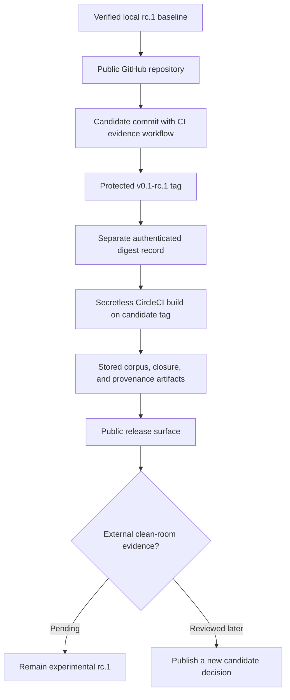

# feat: Ship OFF public release candidate

## Goal Capsule

- **Objective:** Publish the existing experimental OFF v0.1-rc.1 candidate as the public `HenryBranchAdams/open-finance-format` GitHub repository, make its CircleCI acceptance evidence inspectable, establish a separate authenticated checksum-digest record, and deliver the shipping changes through a pull request.
- **Authority:** `STRATEGY.md` governs product identity; `README.md`, `release/v0.1-rc.1/README.md`, `spec/`, and `docs/handoff.yaml` govern the current candidate and its claim boundary.
- **Execution profile:** Release engineering and documentation with one narrow CircleCI configuration enhancement; preserve the committed candidate and its deterministic local acceptance matrix.
- **Stop conditions:** Stop rather than invent an external-evidence pass, alter the pending rc.1 evidence template, promote the candidate to v0.1, or invite clean-room testing without the separate authenticated checksum-digest record.
- **Tail ownership:** LFG owns the implementation, review, GitHub repository creation, public push, PR, and CI observation. A CircleCI project connection that requires an unavailable third-party account action is a surfaced operational residual, not a reason to weaken the release claim.

---

## Product Contract

### Summary

OFF already has a locally verified experimental v0.1-rc.1 implementation and committed CircleCI configuration, but no GitHub remote, immutable public anchor, enabled CircleCI project, or public release surface.
This work makes the candidate discoverable and verifiable as a public release candidate without treating local checks, GitHub publication, or CI success as clean-room interoperability evidence.

### Problem Frame

The candidate cannot begin credible clean-room testing until public materials are reachable at an immutable Git commit and its release closure can be inspected.
The repository must make local CI evidence useful while keeping public-anchor, independent-consumer, independent-producer, timed-authoring, and adoption evidence semantically separate and pending.

### Requirements

- R1. Preserve and track the existing project glossary and solution note as non-normative repository documentation.
- R2. CircleCI must run the existing Node 22, locked-pnpm acceptance matrix and retain machine-readable corpus and release-validation outputs for the checked-out revision.
- R3. The CI workflow and public documentation must describe successful checks as local mechanical conformance and release closure only; they must not claim independent interoperability, adoption, financial correctness, or v0.1 promotion.
- R4. Create the public GitHub repository `HenryBranchAdams/open-finance-format`, configure `origin`, and publish the candidate history without rewriting the candidate commit.
- R5. Create and push the immutable `v0.1-rc.1` tag only after the public candidate commit includes the CircleCI evidence workflow; use the tag/commit as the public candidate anchor.
- R6. Activate or verify the CircleCI project for the public repository and retain the build URL and commit/tag association as local-validation evidence.
- R7. Keep the rc.1 embedded evidence record and checksum authentication fields pending. Before inviting clean-room work, publish the SHA-256 digest of `release/v0.1-rc.1/checksums.json` through a separate authenticated public record and preserve its immutable revision URL.
- R8. The CircleCI acceptance job must be secretless: no contexts, GitHub write credentials, CircleCI API tokens, or other injected secrets are available to a pull-request or tag build.
- R9. The CircleCI build must retain a structured provenance record containing the full commit SHA, tag/ref, runtime versions, command outcomes, and SHA-256 digests of its captured outputs.

### Scope Boundaries

**In scope**

- GitHub publication, a stable release tag, a GitHub release description, CircleCI workflow evidence artifacts, and narrowly scoped release-publication documentation.
- The previously generated `CONCEPTS.md` and `docs/solutions/` learning artifacts.

**Deferred for later**

- Unaffiliated consumer and producer work, ten-minute authoring evidence, public human review, real-model adoption, renderer work, formula execution, XBRL processing, registry/social features, and other asset classes.
- Any change to the two-profile rc.1 normative format or the release closure contract beyond necessary documentation of public publication.

### Acceptance Examples

- AE1. Given a fresh CircleCI checkout at the candidate ref, when the acceptance workflow runs, then it uses Node 22.13.0 and locked pnpm dependencies, passes the repository’s existing matrix, and publishes corpus and release-validation JSON artifacts.
- AE2. Given a public GitHub visitor, when they inspect the rc.1 tag and release surface, then they can identify the exact commit, find the release closure/checksum files, and see that clean-room evidence remains pending.
- AE3. Given a green CircleCI build, when documentation or release text describes it, then the statement is limited to local mechanical validation and does not imply independent interoperability or promotion.
- AE4. Given public publication, when an independent reviewer follows the separate authenticated public record, then they can match its exact candidate commit, tag, and checksum-manifest SHA-256 to the public repository while the candidate’s embedded authentication/evidence fields remain pending.

---

## Planning Contract

### Key Technical Decisions

- KTD-1. **Use the existing rc.1 candidate as the immutable public baseline** (session-settled: user-directed — chosen over rebuilding or renaming the candidate: the user asked to ship the discussed release, and the repository already verifies its release closure). Push the existing history intact and tag the candidate commit rather than changing its normative files to simulate completed external evidence.
- KTD-2. **Make CircleCI artifacts explicit evidence, not a promotion mechanism** (session-settled: user-directed — chosen over treating a green hosted build as v0.1 proof: OFF’s contract separates local conformance from clean-room interoperability). Retain structured corpus and release-validation output, while keeping all external evidence fields pending.
- KTD-3. **Use a public GitHub repository and release tag, not npm publication** (session-settled: user-directed — chosen over package-registry distribution: OFF is a Git-native public specification/research format and `package.json` intentionally remains private). The repository is the candidate distribution root; no package publication is introduced.
- KTD-4. **Preserve release closure boundaries** (session-settled: user-approved — chosen over folding CI and repository docs into the normative allowlist: `.circleci/` and ordinary docs are delivery infrastructure, while the closed release tree remains the current public runtime/specification contract). Do not regenerate rc.1 checksums unless a release-listed artifact changes.

### High-Level Technical Design

### Assumptions

- The authenticated GitHub account `HenryBranchAdams` has authority to create the public repository; preflight confirmed that `HenryBranchAdams/open-finance-format` does not already exist.
- CircleCI’s project activation may require an interactive CircleCI account connection even though the CircleCI CLI and committed configuration are present locally.
- The public tag should refer to the post-review candidate commit containing only non-normative shipping support and the CircleCI evidence workflow; this does not convert pending clean-room evidence into a completed result.
- CircleCI CLI validation requires a CircleCI API token in this environment. If no authenticated token is available, hosted build observation is the authoritative configuration-validation path and local CLI validation remains an explicit residual.
- A public GitHub Gist revision, created under the authenticated maintainer account, is a redundant digest record rather than the separate authenticated channel. It contains only the repository URL, full commit SHA, tag, publication time, and `checksums.json` SHA-256; its exact history-revision URL is recorded later in GitHub release metadata. Before clean-room work, maintainers must additionally select and verify a separately controlled authenticated channel. It contains no clean-room evidence.

### Risks and Dependencies

| Risk or dependency | Mitigation |
|---|---|
| CircleCI cannot be connected without unavailable account authorization | Validate the config locally, push it with the repository, and report the activation step as an operational residual without claiming hosted CI ran. |
| A green build is mistaken for an interoperability claim | Use explicit local-validation language in workflow, publication documentation, and release description; preserve the pending evidence template. |
| A release-listed artifact changes incidentally | Rebuild, regenerate allowlist/checksums if required, and run the full release self-check before publication. |
| Public anchor or tag is rewritten | Create the tag only after the exact candidate commit is reachable; never force-push or mutate the candidate’s embedded evidence record. |
| CircleCI CLI lacks authentication | Do not misreport its unavailable validation as a passing check; retain committed config validation through the hosted build and record the token requirement. |
| CI credentials can be exposed to untrusted PR or tag code | Keep the acceptance job secretless and inspect configuration plus project settings before treating hosted evidence as trustworthy. |

---

## Implementation Units

### U1. Track the established OFF vocabulary and release-evidence learning

- **Goal:** Include the existing non-normative glossary and the local-conformance versus clean-room-interoperability solution note in the repository’s delivery diff.
- **Requirements:** R1, R3.
- **Dependencies:** None.
- **Files:** `CONCEPTS.md`, `docs/solutions/architecture-patterns/separating-local-conformance-from-clean-room-interoperability.md`, `test/docs.test.ts`.
- **Approach:** Preserve the existing source-grounded definitions and solution note; extend documentation contract coverage only if it needs to enumerate these owned artifacts or protect an explicit claim boundary.
- **Patterns to follow:** `docs/START_HERE.md` for authority routing and `docs/handoff.yaml` for pending-evidence terminology.
- **Test scenarios:** Confirm owned documentation contains no superseded contract language; confirm any new local links resolve; confirm the note continues to distinguish local proof from clean-room evidence.
- **Verification:** Documentation checks pass without requiring release allowlist or checksum changes.

### U2. Make CircleCI retain candidate-local conformance evidence

- **Goal:** Keep the existing pinned Node 22 acceptance matrix and store machine-readable corpus and release-validation results for each checked-out ref.
- **Requirements:** R2, R3, R8, R9, AE1, AE3.
- **Dependencies:** U1.
- **Files:** `.circleci/config.yml`, `README.md` only if a concise CI-status explanation is necessary, `test/docs.test.ts` if user-visible claim language changes.
- **Approach:** Retain the pinned Node/Corepack/pnpm setup and all existing acceptance checks. Make the job explicitly secretless—no contexts, API-token variables, or GitHub write credentials—and add an exact tag filter for `v0.1-rc.1` while preserving branch/PR execution. Capture `node dist/off.mjs corpus verify --corpus conformance/corpus.json` and `node scripts/release-validate.mjs --root .` JSON outputs under an `artifacts/` directory. Generate a deterministic provenance JSON record for the checked-out full commit SHA, ref/tag, runtime versions, command outcomes, and SHA-256 values of the captured outputs, then persist the directory with CircleCI’s artifact step. Describe the evidence as local closure for the built ref, never as authentication or promotion. Avoid adding a redundant `pnpm release:self-check` invocation when the equivalent validator result is already captured directly.
- **Patterns to follow:** `.circleci/config.yml` for runtime pinning; `README.md` and `release/v0.1-rc.1/README.md` for claim discipline.
- **Test scenarios:** When CircleCI authentication is available, validate configuration syntax with the CircleCI CLI. Run the two exact captured commands from the repository root and confirm both emit successful structured results; verify the tagged workflow retains both files plus provenance as artifacts; inspect that no contexts or secret environment declarations are configured; verify release documentation tests still leave every external evidence field pending.
- **Verification:** The local acceptance matrix, including the dependency-free corpus command, passes. The hosted tagged build validates the configuration and persists both JSON artifacts and provenance; if CLI authentication is unavailable, report that local CLI-validation boundary explicitly.

### U3. Document the public release procedure and evidence boundary

- **Goal:** Give a public maintainer a concise, truthful procedure for establishing the GitHub anchor, CI evidence, tag, release surface, and outstanding independent-digest requirement.
- **Requirements:** R3, R4, R5, R6, R7, AE2, AE3, AE4.
- **Dependencies:** U2.
- **Files:** `docs/PUBLICATION.md`, `docs/START_HERE.md`, `test/docs.test.ts`.
- **Approach:** Add a non-normative publication guide that points readers to the rc.1 release closure and clean-room tasks, separates a public GitHub/tag/CI anchor from independent checksum authentication, and states that evidence values remain pending in the immutable candidate. Keep mutable build URLs and post-publication receipts out of the closed rc.1 artifacts.
- **Patterns to follow:** `release/v0.1-rc.1/README.md` for publication ordering and `docs/handoff.yaml` for claim status.
- **Test scenarios:** Confirm all relative links resolve; confirm no prose says CI or GitHub publication proves independent interoperability or v0.1; confirm the guide does not instruct maintainers to mutate the pending rc.1 record.
- **Verification:** Documentation tests and release self-check pass with no release artifact drift.

### U4. Establish the public GitHub candidate anchor and authenticated digest record

- **Goal:** Create and configure the public repository, push the shipping candidate without rewriting history, protect and publish the rc.1 tag at that commit, and create its separate authenticated checksum-digest record.
- **Requirements:** R4, R5, R7, AE2, AE4.
- **Dependencies:** U1, U2, U3 and full local verification.
- **Files:** Git remotes, GitHub repository settings, GitHub tag metadata, and a public GitHub Gist; no normative candidate files.
- **Approach:** Create `HenryBranchAdams/open-finance-format` as a public repository with no starter commit, add it as `origin`, and preserve the baseline candidate history. After the shipping candidate commit is publicly reachable, create a GitHub tag ruleset that blocks updates and deletions of `refs/tags/v0.1-rc.1` with no bypass actors; any emergency correction must publish a new candidate. Create an annotated tag at that exact commit. From the tagged tree, calculate the SHA-256 of `release/v0.1-rc.1/checksums.json` and create a public GitHub Gist revision recording only the repository URL, full commit SHA, tag, publication time, and checksum digest. Record its exact immutable history-revision URL in later GitHub release metadata. Before inviting clean-room work, also create and verify the separately controlled authenticated record required by R7. Do not change `checksums.json` or the embedded report.
- **Execution note:** Treat repository creation, remote push, tag ruleset, tag, and Gist creation as external delivery operations; record actual URLs, full SHAs, and ruleset policy only after observing them.
- **Test scenarios:** Verify the GitHub remote, default branch, tag ruleset, and tag resolve to the intended commit; verify the tag ruleset exposes no bypass actor; verify the public Gist revision matches the exact tag target and checksum digest; verify the candidate keeps all embedded external-evidence fields pending.
- **Verification:** `gh repo view`, `git ls-remote`, `gh api` ruleset inspection, `gh gist view`, and local SHA-256 calculation agree on the public repository, exact candidate commit, protected tag, and redundant digest record; the separate authenticated channel is verified using its own documented method before clean-room work.

### U5. Activate and observe CircleCI for the public repository

- **Goal:** Connect the GitHub repository to CircleCI when account access permits and capture the build URL/ref as candidate-local validation evidence.
- **Requirements:** R2, R3, R6, R8, R9, AE1, AE3.
- **Dependencies:** U2, U4.
- **Files:** CircleCI project settings and build artifacts; no candidate evidence-template mutation.
- **Approach:** Validate the committed configuration through an authenticated CircleCI CLI when possible, activate the project through the available CircleCI account/API path, trigger or observe the exact `v0.1-rc.1` tag build, and verify that stored artifacts and provenance correspond to that tag target. If activation or CLI authentication requires authority unavailable to this session, leave the configuration committed and record the missing operational action rather than substituting a local check for hosted CI.
- **Test scenarios:** Confirm the CircleCI build uses the pinned Node version and frozen install; confirm its tag-triggered job succeeds and artifacts include both structured JSON results and provenance; confirm the build/ref URL is not presented as a clean-room pass.
- **Verification:** CircleCI reports a successful acceptance job on the protected public tag, or the final delivery report records the exact activation/CLI-authentication boundary with local config and acceptance evidence.

### U6. Publish the GitHub release surface after evidence is known

- **Goal:** Publish a human-readable GitHub release only after the public anchor, digest record, and hosted-CI evidence state are known.
- **Requirements:** R3, R4, R5, R6, R7, AE2, AE3, AE4.
- **Dependencies:** U4, U5.
- **Files:** GitHub release metadata; no normative candidate files.
- **Approach:** Create or update the GitHub release for `v0.1-rc.1` with the full commit SHA, protected-tag target, release-closure links, exact public Gist revision URL, CircleCI build/artifact URL or explicit unavailable-activation state, and a statement that all embedded clean-room evidence remains pending and the candidate is not v0.1. Treat the release body as convenience documentation, never as the independent authentication record.
- **Test scenarios:** Verify the release links resolve; verify its commit/tag/digest values match U4; verify it describes hosted CI only at its observed level and does not claim clean-room interoperability.
- **Verification:** `gh release view`, `gh gist view`, `git ls-remote`, and the observed CircleCI state agree without altering the rc.1 release closure.

---

## Verification Contract

| Scope | Required evidence | Units |
|---|---|---|
| Documentation | `node --test test/docs.test.ts`, local Markdown-link validation, and claim-boundary review | U1, U3 |
| CI configuration | Authenticated CircleCI config validation when available, inspection that the stored JSON commands and provenance match local release/corpus commands, secretless-job inspection, and tag-triggered hosted-build evidence | U2, U5 |
| Repository behavior | `pnpm check`, `pnpm test`, `pnpm build`, `pnpm test:node22`, `pnpm test:offline`, and `pnpm release:self-check` | U1-U3 |
| Public delivery | GitHub remote/protected-tag/Gist/release inspection and CircleCI build/artifact inspection when the project can be activated | U4-U6 |

---

## Definition of Done

- The tracked repository includes the glossary, solution note, publication guide, and any required documentation-test coverage.
- CircleCI’s committed workflow keeps the pinned acceptance matrix and retains structured corpus and release-validation artifacts for the checked-out ref.
- The CircleCI job declares no contexts or injected secrets and retains structured provenance for the built ref.
- All local repository acceptance checks pass on the shipping branch.
- A public GitHub repository and `origin` remote exist, the intended candidate commit is publicly reachable, and a protected `v0.1-rc.1` tag with no bypass actors records the full commit SHA.
- A public Gist history revision records the candidate tag, full commit SHA, and SHA-256 of `release/v0.1-rc.1/checksums.json`; before clean-room work, a separately controlled authenticated channel records and verifies the same digest, while the candidate’s embedded evidence fields remain pending.
- The GitHub release surface is created only after the public anchor and hosted-CI state are known, and accurately describes its experimental status.
- CircleCI is activated and green for the protected candidate tag, or its unavailable account-activation/CLI-authentication step is precisely recorded without overstating local verification.
- No committed artifact claims independent interoperability, v0.1 promotion, adoption, financial correctness, or independently reviewed lineage.
- The task branch is committed, pushed, and represented by an open pull request with verification evidence.

---

## Sources and Research

- `README.md`, `release/v0.1-rc.1/README.md`, `docs/handoff.yaml`, and `docs/ROADMAP.md` — candidate claim boundaries and publication gates.
- `.circleci/config.yml` and `package.json` — current pinned CI matrix and local acceptance commands.
- `scripts/release-validate.mjs` and `test/release.test.ts` — release closure and pending-evidence enforcement.
- `docs/solutions/architecture-patterns/separating-local-conformance-from-clean-room-interoperability.md` — durable evidence-boundary learning.
- [CircleCI configuration reference](https://circleci.com/docs/reference/configuration-reference/) and [Node.js guide](https://circleci.com/docs/guides/getting-started/language-javascript/) — current `version: 2.1` configuration and Node CI guidance.
